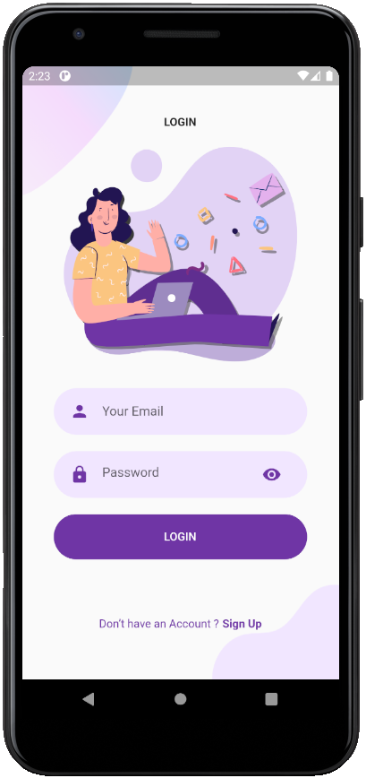
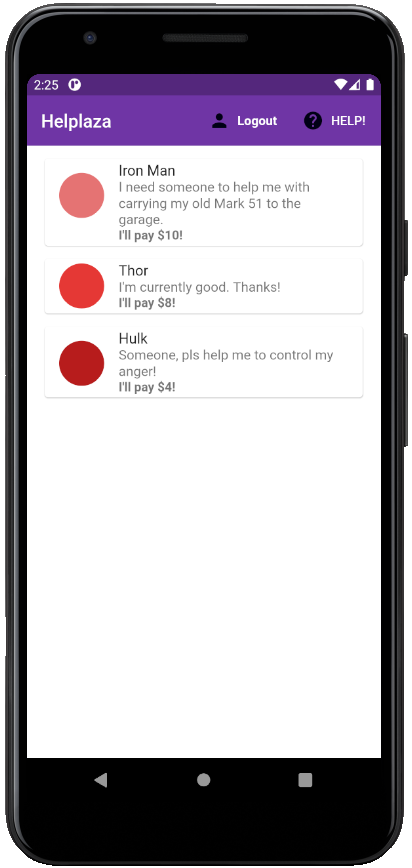
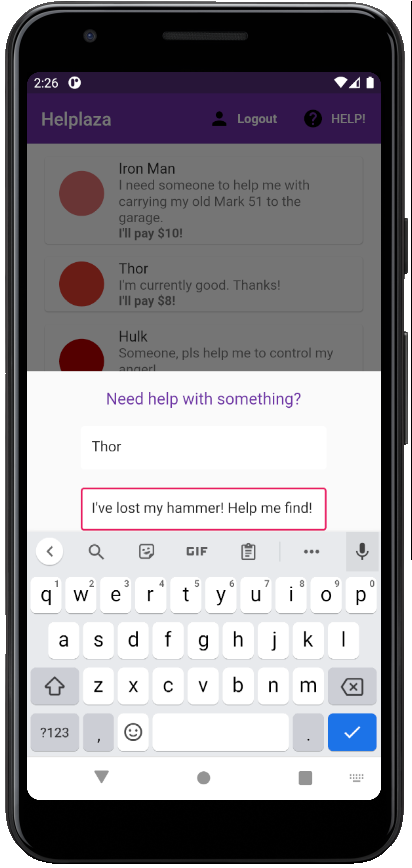
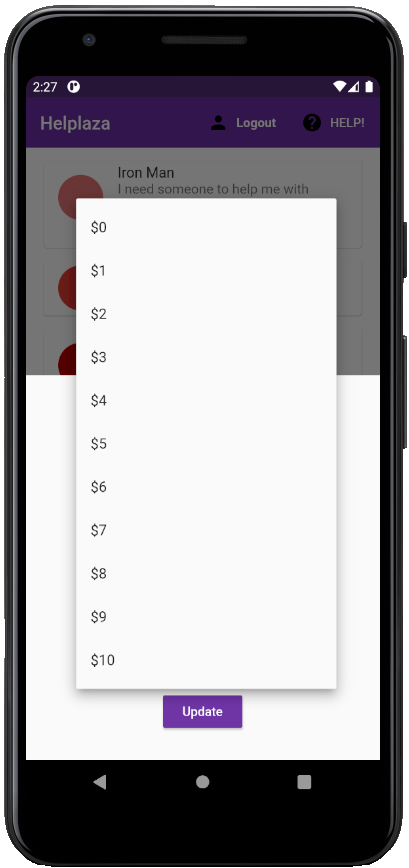
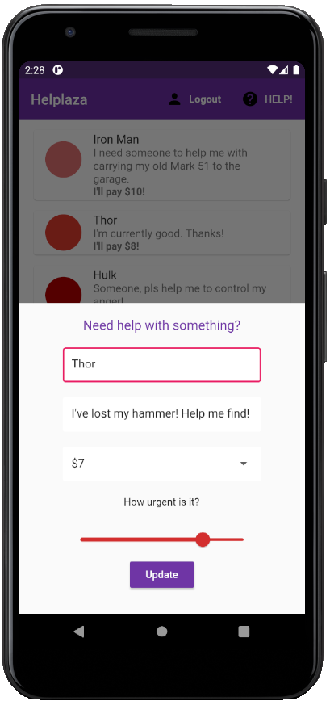

# Helplaza

## 📖 Overview
An app where people of any local community (eg.residential block) post things they need help with, amount they're willing to pay (<= $10) & urgency. Others can see & help them while earning money.

### Inspiration
We have all faced a time where we needed help with something and might even be prepared to pay for it. If only you could let all your neighbors/classmates know that you need someone to help you with something and are willing to pay them up to $10. That's where Helplaza comes in. It solves this issue and lets you tell everyone what you need help with.

### What it does
The app is very simple to use. It should be used by a local community (eg. a residential block). Every member of the community signs up for an account in the app. Their "help" card will be displayed on the home page for all to see. If they do not need help with anything, simply edit the card and say you don't need any help. 

But if you need help with something, edit your card with your:
- Real name
- A description of the task you need help with
- The amount you are willing to pay (only up to $10! It is suppose to be small help)
- Urgency level 

Based on the urgency level you selected, a circle with a red color will be displayed on the card. The more urgent the task, the darker the red circle.

Other users of the app can view the cards of all users (eg. neighbors) in the app and can go and help someone if they are willing to and a ready to earn some cash! Once the help is done, the original user should revert their card to "I'm good!".

## 🚀 Getting Started

Ensure you have Flutter and Android Studio installed in your local machine. Run main.dart to start the application in an emulator.

## 🛠️ Built With 

* Flutter
* Firebase
* Cloud Firestore

## 🎁 Acknowledgments 

* Thanks to [abuanwar072](https://github.com/abuanwar072) for his open sourced sign up page!

---
> This project was submitted for iNTUition v7.0 Hackathon. View the Devpost submission [here](https://devpost.com/software/helplaza).