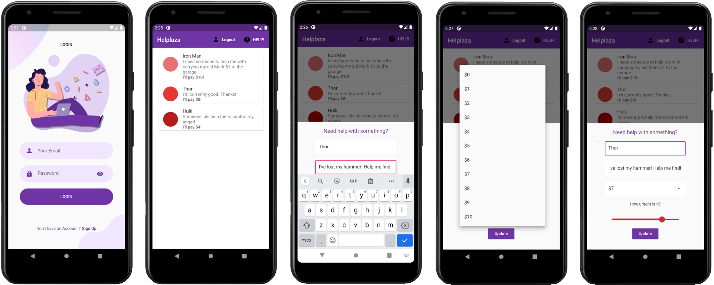

# Helplaza

## 📖 Overview
An app where people of any local community (eg. within a residential block) post things they need help with, the amount money they're willing to pay (≤ $10) & the level of urgency. Other users can view these cards & help them while earning money for it.



### 💡 Inspiration
We have all faced a time where we needed help with something and might even be prepared to pay for it. If only you could let all your neighbors/classmates know that you need someone to help you with something and are willing to pay them. That's where Helplaza comes in. It solves this issue and lets you tell everyone what you need help with.

### 🔎 What it does
The app is very simple to use. It should be used by a local community (eg. within a residential block). Every member of the community signs up for an account in the app. Their "help" card will be displayed on the home page for all to see. If you do not need help with anything, simply edit the card and say that you don't need any help. 

But if you need help with something, edit your card with your:
- Real name
- A description of the task you need help with
- The amount you are willing to pay (only up to $10! It is suppose to be a small help!)
- Urgency level 

Based on the urgency level you selected, a circle with a red color will be displayed on the card. The more urgent the task, the darker the red circle.

Other users of the app can view the cards of all users (eg. neighbors) in the app and can go and help someone if they are willing to and a ready to earn some cash! Once the help is done, the original user should revert their card to "I'm good!". 

The unique thing about this app is, you can't simply "post" as many help as you need. Everyone is given one card and everyone's card is visible. This reduces the chance of abusing the app.

## 🚀 Getting Started

### 📋 Prerequisites 

You will need the following to run the program:
- Flutter
- Android Studio
- Android Emulator/Android Device

### ⚡️ Installing

Clone this repo with:
```
git clone https://github.com/mohamedirfansh/Helplaza
```

Ensure that you have either connected an emulator or an android device.
Navigate to the `lib/` folder and run `main.dart`.

## 🛠️ Built With 

* [Flutter](https://flutter.dev/)
* [Firebase](https://firebase.google.com/)
* [Cloud Firestore](https://firebase.google.com/docs/firestore)

## 🎁 Acknowledgments 

* Thanks to [abuanwar072](https://github.com/abuanwar072) for his sign up page!

---
> This project was built during the iNTUition v7.0 Hackathon. View the Devpost submission [here](https://devpost.com/software/helplaza).